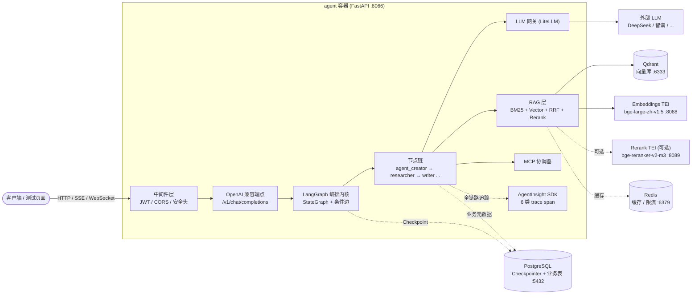
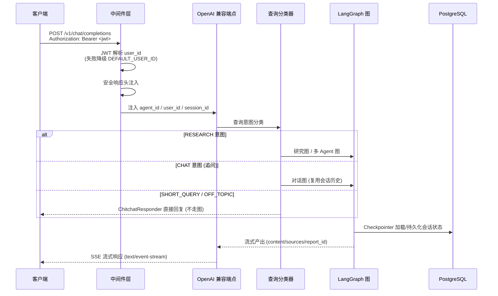
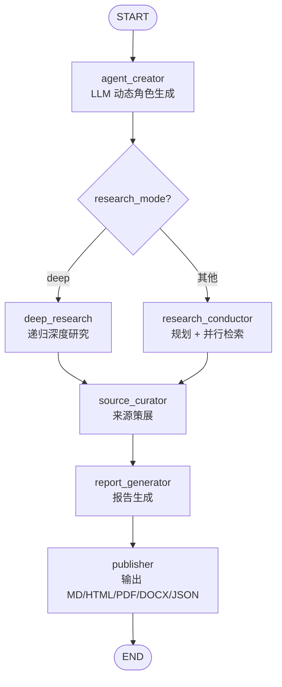
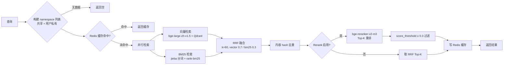
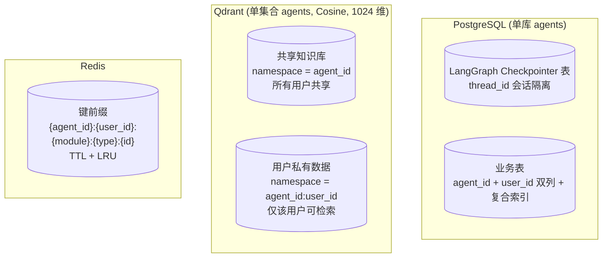
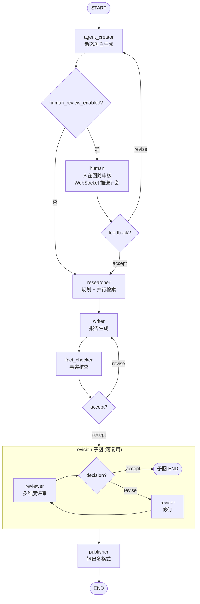
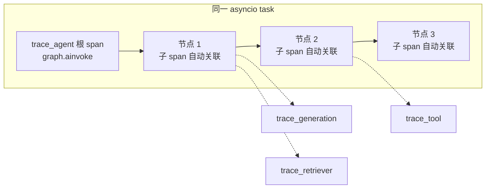
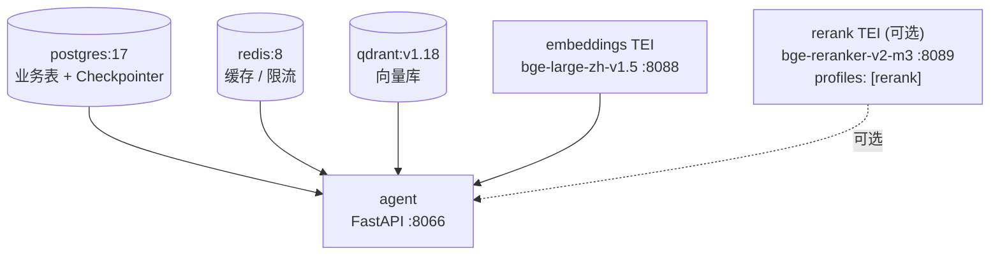

# 架构设计 | Architecture

[中文](#中文) | [English](#english)

---

## 中文

## 1. 系统概览

**agentinsight-researcher** 是一个以 LangGraph 为编排内核、MCP 为工具协议、AgentInsight SDK 为可观测底座的企业级 AI Agent 系统，对外暴露 OpenAI 兼容 API（SSE 流式）。项目定位为**中文优先的研究分析智能体**，对标 GPT Researcher。

### 核心组件



- **编排内核** — LangGraph `StateGraph`（状态机 + 显式条件边 + `PostgresSaver` Checkpointer），三套图：研究图 / 多 Agent 图 / 对话图
- **LLM 网关** — LiteLLM（一次接入 100+ 模型，内置成本/限流/重试），模型名以路由前缀声明（如 `deepseek/deepseek-chat`），由配置注入
- **向量库** — Qdrant（单集合 `agents`，Cosine 距离，1024 维，按 payload `namespace` 隔离），混合检索 BM25 + 向量
- **关系库** — PostgreSQL ≥17（LangGraph Checkpointer 会话持久化 + 业务元数据，单库 `agents` 多 Agent 共享）
- **缓存** — Redis ≥8（热点检索缓存 + 限流 + BM25 语料缓存，LRU + TTL 双策略）
- **Embeddings / Rerank** — HuggingFace TEI 服务：`bge-large-zh-v1.5`（中文最强开源嵌入）+ `bge-reranker-v2-m3`（可选，中文 Rerank SOTA）
- **可观测性** — AgentInsight Python SDK（6 类 trace span，异步上下文管理器，OpenTelemetry Context API 自动传播）

---

## 2. 目录结构与模块边界

```
src/
├── graph/          # LangGraph 图定义 (state / nodes / edges / builder)
│   ├── builder.py          # 研究图 (单 Agent 流水线)
│   ├── multi_agent_builder.py  # 多 Agent 协作图 (线性 + 条件边 + 子图)
│   ├── chat_builder.py     # 对话追问图 (单节点)
│   ├── state.py            # ResearcherState (TypedDict + Annotated reducer)
│   ├── nodes.py            # 节点纯函数实现
│   └── edges.py            # 可复用条件边守卫工厂
├── agents/         # 具体 Agent 实现 (复用图)
│   └── researcher/         # reviewer / reviser / fact_checker / chat_agent / human / supervisor
├── skills/         # 技能定义 (对标 GPT Researcher Skills)
│   └── researcher/
│       ├── agent_creator.py     # 动态角色生成 (对标 GPTR choose_agent)
│       ├── research_conductor.py # 规划 + 并行检索
│       ├── deep_research.py     # 递归深度研究
│       ├── source_curator.py    # 来源策展
│       ├── report_generator.py  # 报告生成
│       ├── publisher.py         # 输出 MD/HTML/PDF/DOCX/JSON
│       ├── query_classifier.py  # 查询意图分类
│       ├── mcp_coordinator.py   # MCP 工具智能选择
│       ├── context_manager.py   # 上下文压缩
│       ├── image_generator.py   # 报告配图
│       ├── searchers/           # 15+ 搜索引擎 (博查/Tavily/Brave/Arxiv/PubMed ...)
│       └── scrapers/            # 网页抓取 (Playwright/Trafilatura/Firecrawl ...)
├── rag/            # 自研 RAG 层
│   ├── retriever.py        # HybridRetriever (BM25 + Vector + RRF + Rerank)
│   ├── qdrant_manager.py   # Qdrant 客户端 + namespace 隔离
│   ├── embeddings.py       # Embeddings 客户端 (统一走 TEI)
│   ├── bm25_filter.py      # BM25 (rank-bm25 + jieba 中文分词)
│   └── embeddings_filter.py
├── llm/            # LiteLLM 网关封装
│   ├── client.py           # LLMClient (achat / achat_stream)
│   └── token_budget.py     # Token 预算管理
├── memory/         # 持久化层
│   ├── checkpointer.py     # PostgresSaver 工厂
│   ├── db_initializer.py   # 启动时业务表初始化 (幂等)
│   └── report_store.py     # 报告元数据存储
├── observability/  # AgentInsight SDK 封装
│   └── tracing.py          # 6 类 trace_xxx + _NoopSpan 降级
├── api/            # FastAPI 路由 + 中间件
│   ├── routes.py           # OpenAI 兼容端点 + 报告/文件
│   ├── middleware.py       # JWTAuth + SecurityHeaders
│   ├── websocket.py        # WebSocket 双向通道 (人在回路)
│   ├── mcp_routes.py       # MCP 配置管理
│   ├── feedback_queue.py   # 人在回路反馈队列
│   └── agent_discovery.py  # Agent Discovery Protocol
├── config/         # 配置 SSOT
│   ├── settings.py         # pydantic-settings 全局 Settings
│   └── researcher/         # 子智能体专属配置 (persona / chitchat 模式)
├── common/         # 公用基础模块 (不依赖 agents/ 或业务模块)
│   ├── redis_client.py     # Redis 全局单例工厂
│   ├── llm_key_resolver.py # LLM 密钥解析
│   └── json_utils.py
└── tools/          # MCP Server 封装 (多 Agent 落地后引入 registry)
```

### 架构边界

- **`graph/` 是首选编排入口** — `agents/` 复用图，不自建编排循环
- **工具/检索/网关/存储互不依赖** — `tools/`、`rag/`、`llm/`、`memory/` 不互相 import，共享逻辑下沉到 `common/`
- **依赖单向向内** — `common/` 不依赖 `agents/` 或业务模块
- **子智能体按名称隔离** — `agents/<name>/`、`config/<name>/`、`skills/<name>/`，不跨子智能体直接引用
- **配置经 `config/` + 环境变量** — 业务代码不硬编码 URL/密钥

---

## 3. 数据流

### 3.1 请求流（Client → SSE 响应）



### 3.2 研究流（单 Agent 研究图）



> 图结构来源：`src/graph/builder.py` 的 `build_researcher_graph()`。`agent_creator` 后的条件边由 `_route_after_agent_creator` 路由：`research_mode == "deep"` 走深度研究，否则走常规并行检索。

### 3.3 检索流（混合 RAG）



> 图结构来源：`src/rag/retriever.py` 的 `HybridRetriever.retrieve()`。BM25 语料从 Qdrant scroll 拉取并经 Redis 缓存（含版本号失效）；singleflight 锁防止缓存击穿。

---

## 4. 数据隔离

### 4.1 三级分键

| 隔离键 | 来源 | 用途 |
|--------|------|------|
| `agent_id` | `= agent_name`，配置注入，全局唯一 | 区分各 Agent，所有持久化层按此分键 |
| `user_id` | JWT Bearer Token 解析（失败降级 `DEFAULT_USER_ID`） | 用户私有数据隔离 |
| `session_id` | `= thread_id`，请求上下文注入 | 会话级状态隔离（Checkpointer） |

### 4.2 持久化层隔离



- **PostgreSQL** — 业务表含 `agent_id` + `user_id` 双列（VARCHAR(64) 复合索引），查询显式 `WHERE agent_id = ... AND user_id = ...`；表名复数 snake_case，不按 Agent/用户拆表
- **Qdrant** — 共享知识库 `namespace = agent_id`（不含 `user_id`，默认召回）；用户私有数据 `namespace = {agent_id}:{user_id}`（仅该用户检索）；点 id 用 `uuid5` 幂等生成
- **Redis** — 所有键加前缀 `{agent_id}:{user_id}:`，会话级数据按 `{agent_id}:{user_id}:{session_id}` 三级分键，设 TTL

---

## 5. 多 Agent 协作

### 5.1 多 Agent 协作图



> 图结构来源：`src/graph/multi_agent_builder.py` 的 `build_multi_agent_graph()`。

### 5.2 设计要点

- **线性 + 条件边模式** — 替代 Supervisor 循环模式，因 `fact_checker`/`reviewer` 的 `accept|revise` 条件边与 Supervisor "回到 supervisor" 循环冲突
- **可复用子图** — `reviewer↔reviser` 评审-修订循环封装为 `build_revision_subgraph()`，主图以 `revision` 节点调用；子图共享同一 `ResearcherState`，不挂 Checkpointer（由父图统一持久化）
- **三类硬上限守卫**（`max_iterations` 不可软超时）：
  - `fact_checker revise → writer`：`create_fact_check_guard(graph_max_iterations)`
  - `reviewer revise → reviser`：`create_revision_guard(max_revisions)`
  - `human revise → agent_creator`：`create_human_review_guard(max_plan_revisions)`
- **人在回路** — `human_review_enabled=True` 时，`agent_creator` 与 `researcher` 间插入 `human` 节点，通过 WebSocket 推送研究计划给前端，阻塞等待用户反馈（`asyncio.Future`，带超时）

---

## 6. 可观测性

### 6.1 六类 trace span

| trace 类型 | as_type | 包裹位置 | 说明 |
|---|---|---|---|
| `trace_agent` | `agent` | 编排器入口，包裹 `graph.ainvoke()` | 根 span，建立 Agent 级追踪 |
| `trace_generation` | `generation` | `llm/` 网关层（`LLMClient.achat`/`achat_stream`） | LLM 调用，含 model/usage/cost |
| `trace_tool` | `tool` | MCP 工具调用节点 | 工具名 + 参数 + 结果 + success |
| `trace_retriever` | `retriever` | RAG 检索节点（BM25/Vector/Qdrant） | 含 matched/candidate_count/top_score |
| `trace_chain` | `chain` | 多步骤链式调用（RAG 管道、子图编排） | 链式调用追踪 |
| `trace_embedding` | `embedding` | `rag/embeddings.py` | 高频调用，head-based 采样（默认 0.5） |

### 6.2 跨节点 span 传播



- **OpenTelemetry Context API 自动传播** — 父子关系在同一 asyncio task 内自动建立，不手动传递 span 对象
- **`trace_agent` 包裹 `graph.ainvoke()` 作为根 span** — LangGraph 节点内创建的子 span 自动关联到根 span
- **认证上下文不用 span 传播** — token/user_id 通过 `contextvars` + State 字段在节点入口显式恢复（安全硬约束）
- **Null Object 降级** — SDK 初始化失败或运行时异常时，所有 `trace_xxx` yield `_NoopSpan`，业务代码无需判断 SDK 是否可用，`span.update()` 永远安全

### 6.3 采样策略

- `trace_agent` / `trace_generation` / `trace_tool` / `trace_retriever` / `trace_chain` — 全量 1.0 采样
- `trace_embedding` — head-based 采样，默认 `tracing_embedding_sample_rate=0.5`（高频 embed 调用降采样减存储压力）
- SDK 底层用 `BatchSpanProcessor` 后台线程批量导出，HTTP 上报失败不阻塞主流程

---

## 7. 部署架构

### 7.1 三套构建模式

| 模式 | 构建文件 | 编排文件 | 环境文件 | 适用场景 |
|------|---------|---------|---------|---------|
| QA 模式（离线） | `Dockerfile.qa` | `docker-compose-qa.yaml` | `.env.qa` | QA 测试、内网环境 |
| 生产模式（联网） | `Dockerfile` | `docker-compose.yml` | `.env` | 开源社区、CI、外网环境 |
| 生产模式（离线） | `Dockerfile.offline` | `docker-compose-offline.yaml` | `.env` | 内网生产环境、离线部署 |

- **QA / 生产离线模式** — 所有依赖（wheels/debs/models/images）宿主机预下载到 `packages/`，构建时离线安装，部署时 `docker load` 加载镜像
- **生产联网模式** — 构建时从 PyPI 下载 Python 依赖、从 Docker Hub 拉取基础镜像
- 部署务必使用构建脚本（`docker-build.sh` / `docker-build.qa.bat` / `docker-build.offline.sh`），脚本内置 `-p agentinsight` 项目名

### 7.2 容器编排（6 容器）



| 服务 | 镜像 | 端口 | 健康检查 | 对外暴露 |
|------|------|------|---------|---------|
| `agent` | 本仓 `Dockerfile`（Python 3.12-slim，非 root） | 8066 | `GET /health` | ✅ |
| `embeddings` | `tei-embedding:cpu-1.9`（bge-large-zh-v1.5） | 8088 | `GET /health` | ✅ |
| `rerank`（可选） | `tei-embedding:cpu-1.9`（bge-reranker-v2-m3） | 8089 | `GET /health` | ✅ |
| `qdrant` | `qdrant/qdrant:v1.18.0` | 6333 / 6334 | `/healthz` | 6333 ✅ / 6334 仅本机 |
| `redis` | `redis:8` | 6379 | `redis-cli ping` | 仅本机 |
| `postgres` | `postgres:17` | 5432 | `pg_isready` | 仅本机 |

### 7.3 依赖顺序与启动初始化

- **依赖顺序**（`depends_on: service_healthy`）：`postgres` → `redis` → `qdrant` → `embeddings` → `agent`（`rerank` 可选，`agent` 不强制依赖）
- **Agent 启动时初始化**（`server.py` lifespan）：
  1. PostgreSQL 业务表初始化（`init_database()` 执行 `scripts/init.sql`，幂等 `CREATE TABLE IF NOT EXISTS`，失败不阻断启动）
  2. Qdrant 集合就绪检查（同步等待，避免首请求竞态）
  3. Embeddings 批量预热（后台执行，触发 TEI 模型加载）
  4. 遗留种子数据清理（后台执行）
- **APIKey 鉴权** — Qdrant（`QDRANT__SERVICE__STATIC_API_KEY`）、Embeddings/Rerank TEI（`API_KEY`）均通过环境变量开启鉴权，客户端经配置传递，禁止硬编码

---

## English

## Architecture Overview

**agentinsight-researcher** is an enterprise-grade AI Agent system with LangGraph as the orchestration core, MCP as the tool protocol, and AgentInsight SDK as the observability backbone, exposing an OpenAI-compatible API (SSE streaming). It is a **Chinese-first research analysis agent** benchmarked against GPT Researcher.

### Core Components

- **Orchestration Core** — LangGraph `StateGraph` (state machine + explicit conditional edges + `PostgresSaver` checkpointer). Three graphs: research / multi-agent / chat
- **LLM Gateway** — LiteLLM (unified access to 100+ models with built-in cost/rate-limit/retry)
- **Vector Store** — Qdrant (single `agents` collection, Cosine distance, 1024-dim, isolated by payload `namespace`), hybrid BM25 + vector retrieval
- **Relational DB** — PostgreSQL ≥17 (LangGraph Checkpointer session persistence + business metadata, single `agents` DB shared across agents)
- **Cache** — Redis ≥8 (hot retrieval cache + rate limiting + BM25 corpus cache, LRU + TTL)
- **Embeddings / Rerank** — HuggingFace TEI: `bge-large-zh-v1.5` + `bge-reranker-v2-m3` (optional)
- **Observability** — AgentInsight Python SDK (6 trace span types, async context managers, OpenTelemetry Context API auto-propagation)

### Data Flow

1. **Request flow** — Client → FastAPI middleware (JWT/CORS/security headers) → OpenAI-compatible endpoint → LangGraph graph → node chain → SSE streaming response
2. **Research flow** (single-agent graph) — `agent_creator` → (`deep_research` | `research_conductor`) → `source_curator` → `report_generator` → `publisher`
3. **Retrieval flow** — BM25 + Vector → RRF fusion (k=60) → optional Rerank → `score_threshold` filtering

### Data Isolation

Three-tier key isolation across all persistence layers:
- `agent_id` (= agent_name, globally unique)
- `user_id` (resolved from JWT Bearer Token, degrades to `DEFAULT_USER_ID`)
- `session_id` (= thread_id, injected from request context)

- **PostgreSQL** — Business tables with `agent_id` + `user_id` dual columns + composite index
- **Qdrant** — Shared knowledge base `namespace = agent_id`; user-private data `namespace = {agent_id}:{user_id}`
- **Redis** — Key prefix `{agent_id}:{user_id}:{module}:{type}:{id}` with TTL

### Multi-Agent Collaboration

Linear + conditional-edge pattern (replaces Supervisor loop): `agent_creator` → [human] → `researcher` → `writer` → `fact_checker` → revision subgraph (`reviewer`↔`reviser`) → `publisher`. Three hard-limit guards (`max_iterations` not soft-timeout): fact-check guard, revision guard, human-review guard. The `reviewer`↔`reviser` loop is encapsulated as a reusable subgraph.

### Observability

6 trace span types: `trace_agent` (root span wrapping `graph.ainvoke()`), `trace_generation` (LLM gateway), `trace_tool` (MCP tools), `trace_retriever` (RAG), `trace_chain` (multi-step chains), `trace_embedding` (head-based sampling 0.5). OpenTelemetry Context API auto-propagates parent-child relationships within the same asyncio task. Null Object (`_NoopSpan`) degradation when SDK unavailable.

### Deployment

Three build modes: QA offline / production online / production offline. Six-container stack: `agent` / `embeddings` / `rerank` (optional) / `qdrant` / `redis` / `postgres`. Dependency order with `service_healthy` conditions. Agent container initializes PostgreSQL business tables and Qdrant collections on startup (idempotent). APIKey authentication for Qdrant and TEI services via environment variables only.

---

> 本文档基于项目实际代码编写。详细的开发规范与约束请参阅 [AGENTS.md](../AGENTS.md)（14 章规范），API 接口详情请参阅 [README.md](../README.md)。
